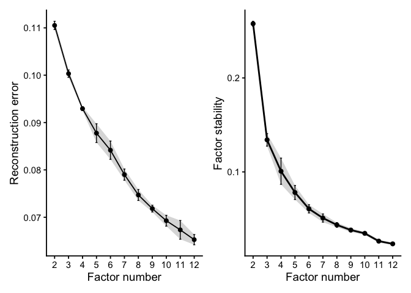
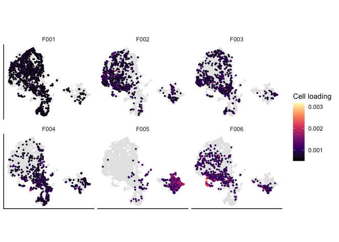

# lemurBiclust


# lemurBiclust

`lemurBiclust` identifies structured cellular programs within
differential expression patterns estimated by
[LEMUR](https://github.com/const-ae/lemur).

Single-cell perturbation experiments can contain heterogeneous responses
that are difficult to describe with a single differential expression
contrast. `lemurBiclust` uses a biclustering procedure derived from NMF
to identify groups of genes and cells that jointly contribute to
differential expression, providing a compact representation of
heterogeneous differential programs.

The package is currently an **early prototype (v0.1.0)** and
proof-of-concept. The core workflow is functional, but the API,
documentation, features, and installation may change substantially,

## Overview

A typical `lemurBiclust` analysis consists of four steps:

1.  Fit a differential expression model with LEMUR.
2.  Explore an appropriate number of biclustering factors.
3.  Construct stable gene-cell biclusters.
4.  Characterize the resulting programs using conventional differential
    expression and gene-set enrichment analysis.

This README demonstrates the workflow using the glioblastoma example
data distributed with `lemur`.

## Installation

`lemurBiclust` is currently available as a development package.

``` r
# install.packages("remotes")
remotes::install_github("Herbermann/lemurBiclust")
```

## Example

### LEMUR differential expression

We start from the example glioblastoma single-cell dataset provided by
LEMUR. The data contain cells from multiple patients under control and
panobinostat treatment.

``` r
library(tidyverse)
library(SingleCellExperiment)
library(lemur)
library(lemurBiclust)

set.seed(11)

data("glioblastoma_example_data", package = "lemur")

glioblastoma_example_data
```

    class: SingleCellExperiment 
    dim: 300 5000 
    metadata(0):
    assays(2): counts logcounts
    rownames(300): ENSG00000210082 ENSG00000118785 ... ENSG00000167468
      ENSG00000139289
    rowData names(6): gene_id symbol ... strand. source
    colnames(5000): CGCCAGAGCGCA AGCTTTACTGCG ... TGAACAGTGCGT TGACCGGAATGC
    colData names(10): patient_id treatment_id ... sample_id id
    reducedDimNames(0):
    mainExpName: NULL
    altExpNames(0):

We fit a LEMUR model accounting for patient identity and treatment
condition. Half of the cells are held out from model. The training/test
separation is also respected by `lemurBiclust`.

``` r
fit <- lemur(
    glioblastoma_example_data,
    design = ~ patient_id + condition,
    n_embedding = 15,
    test_fraction = 0.5
)

fit <- test_de(
    fit,
    contrast =
        cond(condition = "panobinostat") -
        cond(condition = "ctrl")
)
```

`lemurBiclust` operates on the differential expression structure
estimated by LEMUR. `preprocess_assay()` prepares this matrix for
biclustering. Here, preprocessing respects the split by training and
test data.

``` r
mat <- preprocess_assay(fit, "DE")
```

It is possible to combine multiple contrasts, e.g. ‘treatment_1’ and
‘treatment_2’ vs ‘control’;

``` r
mat_1 <- preprocess_assay(fit, "DE_treatment_1")
mat_2 <- preprocess_assay(fit, "DE_treatment_2")

mat <- compose_multi_view(
    list("treatment_1" = mat_1, "treatment_2" = mat_2)
    )
```

which enables biclustering under multiple contrasts. All subsequent
steps support such a multi-view structure in principle.

### Explore the number of factors

The number of biclustering factors can be explored over a range of
candidate values.

``` r
explorer <- explore_factors(
    mat,
    ks = c(2, 3, 4, 5, 6, 7, 8, 9, 10, 11, 12),
    n_restarts = 5,
    test_fraction = 0.1,
    tol = 0.01
)

plot(explorer)
```



`explore_factors()` is intended as an optional guidance rather than an
automatic model-selection criterion and may suggest reasonable number of
biclusters for the actual fitting procedure. There is generally no right
or wrong number of bicluster candidates to be fit to the data. In the
above example, $k=6$ is around a point of diminishing returns. A larger
number of factors may result in biclusters with more mutual overlap in
expressed genes and recruited cells but that differ in a subgroup of
genes or cells.

For this example we therefore continue with six factors.

### Construct biclusters

``` r
biclustering <- biclust(
    mat,
    k = 6,
    use_test = TRUE,
    n_reps = 50,
    tol = 0.005,
    gene_support_thrs = 0.9,
    cell_support_thrs = 0.9
)
```

Each bicluster contains a weighted gene program together with cells
associated with that program. Cell and gene membership is continuous
rather than merely binary, allowing strongly and weakly associated
members to be distinguished.

The factorization is repeated to identify stable bicluster structure
rather than relying on a single NMF solution.

A reduced object

``` r
bics <- biclusters(biclustering)
names(bics)
```

    [1] "F001" "F002" "F003" "F004" "F005" "F006"

may be extracted, which contains named biclusters, and each bicluster
contains named vectors of cell, gene and test cell loadings.

## Visualizing cellular programs

We can project the bicluster cell loadings onto a two-dimensional
representation of the LEMUR embedding.

``` r
umap <- uwot::umap(t(fit$embedding))

rownames(umap) <- colnames(fit$embedding)
colnames(umap) <- c("UMAP1", "UMAP2")

umap_df <- data.frame(
    cell = rownames(umap),
    UMAP1 = umap[, 1],
    UMAP2 = umap[, 2]
)

plot_df <- dplyr::bind_rows(
    lapply(names(bics), function(bic_name) {

        bic <- bics[[bic_name]]

        # Combine loadings from training and held-out cells
        loadings <- c(
            bic$cells,
            bic$test
        )

        out <- umap_df
        out$loading <- NA_real_

        idx <- match(names(loadings), out$cell)
        keep <- !is.na(idx)

        out$loading[idx[keep]] <- loadings[keep]
        out$bicluster <- bic_name

        out
    })
)

p <- ggplot(
    plot_df,
    aes(x = UMAP1, y = UMAP2)
) +
    geom_point(
        data = \(x) dplyr::filter(x, is.na(loading)),
        color = "grey90",
        size = 0.4
    ) +
    geom_point(
        data = \(x) dplyr::filter(x, !is.na(loading)),
        aes(color = loading),
        size = 0.6
    ) +
    facet_wrap(
        ~ bicluster,
        ncol = 3
    ) +
    scale_color_viridis_c(
        option = "magma",
        name = "Cell loading"
    ) +
    coord_equal() +
    theme_classic() +
    theme(
        axis.title = element_blank(),
        axis.text = element_blank(),
        axis.ticks = element_blank(),
        strip.background = element_blank()
    )
```



This provides a first view of where each differential program occurs in
the cellular state space. Cells not assigned to a given bicluster are
shown in grey.

## Bicluster composition

Biclusters can be compared with experimental or biological annotations
stored in the LEMUR object, e.g.

``` r
patients <- bicluster_composition(
    bics,
    fit,
    "patient_id"
)

condition <- bicluster_composition(
    bics,
    fit,
    "condition"
)
```

and is returned as

``` r
head(patients, 5)
```

        variable label   n bic_size label_size fraction_bic fraction_label
    1 patient_id PW030 130      826       1000    0.1573850          0.130
    2 patient_id PW032 175      826       1000    0.2118644          0.175
    3 patient_id PW034 142      826       1000    0.1719128          0.142
    4 patient_id PW036 168      826       1000    0.2033898          0.168
    5 patient_id PW040 211      826       1000    0.2554479          0.211
      cell_slot bicluster
    1      test      F001
    2      test      F001
    3      test      F001
    4      test      F001
    5      test      F001

This is useful for determining whether a program is shared across
patients, associated predominantly with one treatment condition, or
concentrated in a particular annotated cell population if such
annotations are available.

## Differential expression within biclusters

`bicluster_edgeR()` performs pseudobulk differential expression within
each bicluster while retaining the experimental design.

``` r
biclustering <- bicluster_edgeR(
    biclustering,
    fit,
    use_assay = "counts",
    group_by = c("patient_id", "condition"),
    design = ~ patient_id + condition,
    contrast =
        cond(condition = "panobinostat") -
        cond(condition = "ctrl")
)
```

Results are stored with the `BiclustResult` object:

``` r
head(analyses(biclustering)$edgeR$F001)
```

                         logFC    logCPM        F       PValue        FDR
    ENSG00000245532  1.5603526 10.115305 71.41883 5.244139e-05 0.01573242
    ENSG00000187193  2.1402656 10.178715 46.31579 1.721241e-04 0.02342257
    ENSG00000170458 -3.3634272  7.823731 31.80095 2.342257e-04 0.02342257
    ENSG00000118785 -1.6043316 14.010626 32.44016 6.423694e-04 0.04817770
    ENSG00000236824  0.9828048 12.765209 30.03062 8.208708e-04 0.04925225
    ENSG00000130208 -1.9537667  8.780870 22.55898 1.206096e-03 0.05188554
                               gene
    ENSG00000245532 ENSG00000245532
    ENSG00000187193 ENSG00000187193
    ENSG00000170458 ENSG00000170458
    ENSG00000118785 ENSG00000118785
    ENSG00000236824 ENSG00000236824
    ENSG00000130208 ENSG00000130208

This allows the analysis to ask two related but different questions:

- Which genes and cells define a differential program?
- How does expression within those cells change between experimental
  conditions?

Alternatively, `bicluster_edgeR()` can be called with
`bicluster_edgeR(bics, fit, ...)`, where
`bics <- biclusters(biclustering)` is the reduced bicluster
representation from above.

## Gene-set enrichment

The signed bicluster gene programs can also be tested against the
corresponding differential-expression rankings using GSEA.

``` r
biclustering <- bicluster_gsea(biclustering)
```

``` r
analyses(biclustering)$gsea
```

       bicluster      pathway         pval         padj   log2err         ES
    1          1 default.down 2.158961e-10 4.317922e-10 0.8266573 -0.8478196
    2          1   default.up 1.908902e-08 1.908902e-08 0.7337620  0.7412136
    3          2 default.down 2.600818e-06 2.600818e-06 0.6272567 -0.7185700
    4          2   default.up 2.354472e-08 4.708943e-08 0.7337620  0.7141858
    5          3 default.down 2.012822e-04 2.012822e-04 0.5188481 -0.7478105
    6          3   default.up 2.701000e-09 5.402000e-09 0.7749390  0.7670127
    7          4 default.down 2.915379e-05 2.915379e-05 0.5756103 -0.7853830
    8          4   default.up 4.622045e-08 9.244091e-08 0.7195128  0.7541292
    9          5 default.down 6.215684e-10 1.243137e-09 0.8012156 -0.7697266
    10         5   default.up 5.874170e-06 5.874170e-06 0.6105269  0.5875486
    11         6 default.down 4.999062e-03 4.999062e-03 0.4070179 -0.5693976
    12         6   default.up 3.034018e-06 6.068037e-06 0.6272567  0.6541098
             NES size  leadingEdge
    1  -2.198603   34 ENSG0000....
    2   2.463497   39 ENSG0000....
    3  -2.205239   28 ENSG0000....
    4   2.384278   43 ENSG0000....
    5  -1.831233   22 ENSG0000....
    6   2.552861   36 ENSG0000....
    7  -2.024489   19 ENSG0000....
    8   2.461182   36 ENSG0000....
    9  -2.357735   37 ENSG0000....
    10  2.124748   47 ENSG0000....
    11 -1.699451   31 ENSG0000....
    12  2.171906   46 ENSG0000....

Positive and negative sides of each bicluster are tested separately.
This provides a program-level assessment of whether the structure
identified by the biclustering is indeed enriched at the tail ends of
the ranking of all differentially expressed genes, which would be the
canonical expectation here. Further support for custom gene set
enrichment within biclusters is planned, this would allow e.g. a pathway
annotation of differential programmes.

## Development status

`lemurBiclust` is under active development.

Version **0.1.0** represents the first functional research prototype of
the core workflow. At this stage:

- the core LEMUR-to-bicluster analysis is implemented;
  - preprocessing and bundling of DE assays
  - factor number exploration
  - consensus NMF procedure for stable factorization
  - automated post-hoc sparsification to remove noise and make
    biclusters interpretable
- held-out cells are projected onto the discovered programs;
- bicluster composition can be inspected using cell-level metadata or
  annotation;
- bicluster-specific pseudobulk differential expression is available;
- bicluster programs can be evaluated using gene-set enrichment
  analysis.

The API and internal data structures should be considered unstable.

## Citation

`lemurBiclust` is currently under development.
